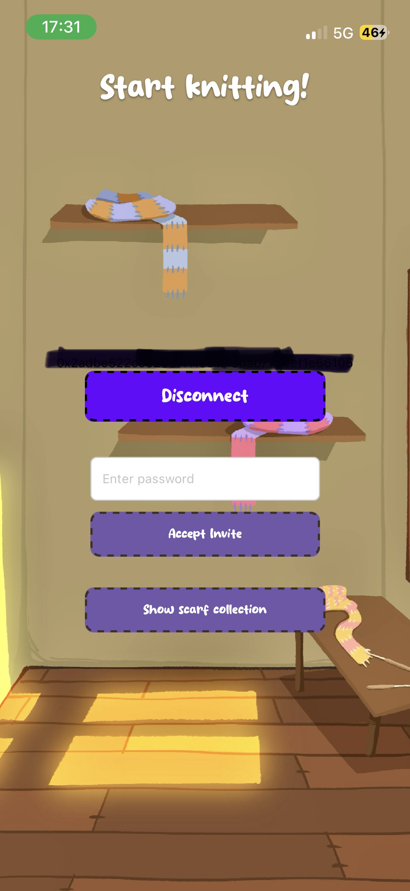

# weavETH

A mobile-first social Web3 app where meaningful human connections are represented on-chain through digital scarves, patches, and milestone memories. Our goal is to weave meaningful relationships on-chain so a trace of them may endure forever.

## Interface Preview

<p align="center">
	
	
	
</p>

<p align="center">
	
	
	
</p>

## Project Background

This app was created during our participation in the ETHPrague hackathon in Prague.

The concept is to create a shared scarf of memories with someone you hold dear. By connecting your wallet and their wallet to the app, both people can share one scarf using a scarf code. You can then choose a photo that represents a memory you want to preserve.

Using an integrated AI module, the photo is transformed into scarf-like fabric material. Each memory becomes an NFT preserved on the blockchain.

This project was created with Petre Giorgi and Tjaz Juvan.

## What This Project Is About

weavETH explores a non-financial blockchain experience. Instead of focusing on trading, the app focuses on relationships:

- Create and personalize scarves
- Attach memory patches (images + metadata)
- Track milestones in the relationship lifecycle
- Store long-term relationship signals on-chain

The core idea is to make blockchain feel personal and emotional, not only transactional.

## Tech Stack

- Backend: Hardhat with Solidity smart contracts
- Frontend: React Native (Expo)
- Web3 Integration: WalletConnect and Ethers.js

## How We Built It

### Product Direction

- Designed as a relationship-first onboarding path to Web3
- Kept UX visual and story-driven (textures, sprites, collectibles)
- Prioritized mobile flow with Expo + React Native

### Frontend

- Expo + React Native app structure with file-based routing (Expo Router)
- Reusable UI components for navigation and actions
- Image workflows via Expo modules (picker, assets, file system)

### Web3 / Blockchain

- WalletConnect-based wallet connection flow
- Ethers.js integration for contract interaction
- Contract layer (ScarfBank / tokens) in the Hardhat workspace

### Smart Contracts

- Solidity contracts in the parallel Hardhat setup
- Token/memory-related contracts and deployment modules
- ABI + address wiring into mobile app constants

## Project Structure (Main App Folder)

- `app/`: Expo Router screens and route layouts
- `components/`: Reusable UI and feature components
- `assets/`: Fonts, sprites, textures, icons, screenshots
- `constants/`: ABIs, chain addresses, fixed config values
- `hooks/`: Shared hooks (theme, ethers helpers)
- `contracts/`: Local smart contract workspace references

## Setup

Use the provided install script:

```bash
./scripts/setup-project.sh
```

Then start Metro:

```bash
npx expo start -c
```

## Runtime Notes

- This project currently targets Expo SDK 54 (`expo@^54.0.0`).
- Use an Expo Go version that supports SDK 54, or use a dev build.

## Team / Credits

- Fullstack: Amir Eid
- Backend: Tjaz Juvan
- Frontend + Graphics: Petra Giorgi

## License

N/A
